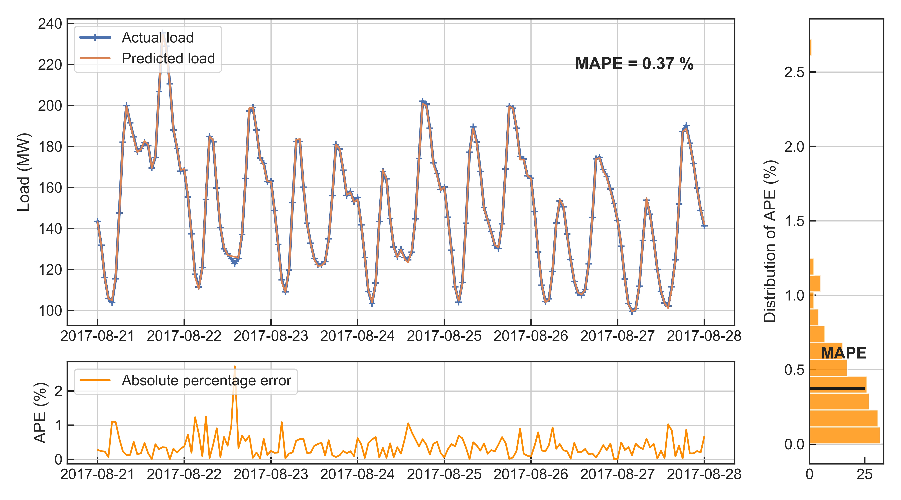

## STLF: Short-term Load Forecasting
### Machine learning for time-series electric power load forecasting

**Ausgrid Substation Data**
Ausgrid, “Distribution zone substation information data to share,” http://www.ausgrid.com.au/Common/About-us/Corporate-information/Data-to-share/DistZone-subs.aspx#.WYD6KenauUl, accessed May, 2019.

**DarkSky API** 
Weather data from https://darksky.net/dev

**Abstract**
Substation level (132/11 kV) electric power load time-series data from the Ausgrid provider is studied, in combination with a local weather data gathered by means of using a DarkSky API.

**Stacking ensemble notebook**
A machine learning ensemble is built (i.e. stacked ensemble) of several base models, in order to forecast substation hourly load for a weeks time, with the use of weather information (i.e. short-term load forecasting). Some of the base models are also ensembles themselves (Boosting ensembles, Forest of trees, etc.), which are stacked using the ElasticNet linear regression, and a weighted average, as a second-stage models. Training data set is used for training the base models, where optimal base model's hyper-parameters are determined by the grid search with time-series cross-validation on the training set. Bayesian optimization is used for fine-tunning the model's hyper-parameters, in case of the Support Vector Regression model. Validation set is used only for training the second-stage models, which stack the base models into an ensemble. Stacking is carried-out using penalized linear regression. Again, grid search with time-series cross-validation is used on the validation set to fine-tune the ensemble. The final set of base models, along with the second-stage model (i.e. stacked ensemble), that have been fine-tuned and freezed, are once more re-trained on the entire data set (training + validation sets). The base models and ensemble are then tested using the (never seen before) test set.

This Jupyter Notebook can be seen rendered using the nbviewer [here](https://nbviewer.jupyter.org/github/sarajcev/STLF/blob/master/Load_forecast_stack.ipynb). This notebook serves as a _partial_ code base for the following [research paper](https://ieeexplore.ieee.org/document/9140676), which provides explanations and visual guides for the stacking ensemble building process.

**Deep neural networks notebook**
Several different deep neural networks are presented for the hour-ahead load forecasting with the use of weather information (i.e. short-term load forecasting). Presented are (1) convolutional deep neural networks with GRU layers, (2) feed-forward deep neural network and (3) wide and deep feed-forward neural network. Network architectures are fixed in advance. This Jupyter Notebook can be seen rendered using the nbviewer [here](https://nbviewer.jupyter.org/github/sarajcev/STLF/blob/master/Load_forecast_dnn.ipynb).
